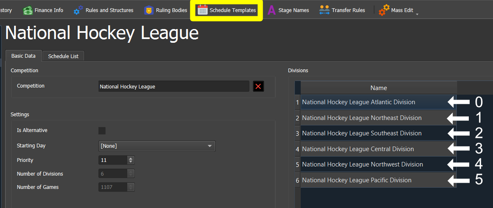
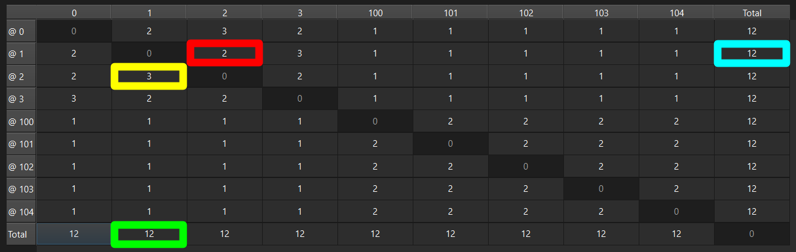

# EHM Schedule Tool
:rocket: A tool for generating schedule templates for Eastside Hockey Manager. :calendar:

Find more tools for Eastside Hockey Manager on [The Blue Line](https://ehmtheblueline.com).

# How to Install
1. Download and install [Microsoft Visual Studio 2022 Redistributable (x64 / 64-bit version)](https://aka.ms/vs/17/release/VC_redist.x64.exe) if you do not already have this installed;

1. Download the latest version of the Tool from the [Releases](https://github.com/archibalduk/EHM_Schedule_Tool/releases) page;

1. Extract the downloaded *.zip* file to a folder of your choice; and

1. Double-click on the downloaded *EHM Schedule Tool.exe* file to launch the Tool.

# How to Use
There are three ways in which schedule templates can be generated using the Tool:

1. From scratch by following the Tool's prompts *(Generate -> New schedule template)*;

1. From an existing schedule matrix *(Generate -> New schedule template from matrix spreadsheet)*;

1. From a text schedule *(File -> Open text schedule)*; or

1. From an existing schedule template *(File -> Open schedule template)*.

Step-by-step instructions are set out further below (see the *How to Generate a Schedule Template* section below).

The Tool also includes a few tool functions to tweak schedule templates (see the *Extra Tools* section below).

# Introduction
It is worth understanding a few basic concepts before using the Tool for the first time.

## What is a schedule template?
There are two types of schedule which can be assigned to a playable league in the EHM game database:

1. Schedule dates: This is essentially a list of dates from which the game will automatically generate a basic schedule. This can only be used for simpler league structures; it cannot generally be used for multi-conference/division setups.

1. Schedule templates: This is a fully custom schedule which must be created by hand. Each individual game must be listed out in the template; i.e. road club id, home club id and date. 

The Tool is intended to simplify the creation of schedule templates by automatically generating the schedule based on various custom parameters.

Schedule templates can be imported from a spreadsheet into an EHM database using the unofficial [EHM Editor](https://ehmtheblueline.com/editor) by Archibalduk.

Each club in a schedule template is represented by an id number in the following format: *[Division index][Club index]*

Each division of the playable league in question and as listed on the *Schedule Templates* screen of the EHM Editor is assigned an index number. The first division listed is 0 (zero), the second division is 1 (one), etc:

Each club within each division is allocated an index number based on the alphabetical order of each club. The first club within a division will have index 0 (zero), the second club will have index 1 (one), etc.

Here are some examples:

- 0000 = First division, first club within that division
- 0001 = First division, second club within that division
- 0100 = Second division, first club within that division
- 0101 = Second division, second club within that division
- 0205 = Third division, sixth club within that division
- 0206 = Third division, seventh club within that division

Note that zeros at the beginning of the club id values will be truncated when viewed in the Tool or Excel; e.g. 0001 will be shown as 1, 0205 will be shown as 205, etc.

Here are some example games within a schedule template:

| Road Club | Home Club | Day of Month | Month | Year Offset |
| --- | --- | --- | --- | --- |
| 0 | 100 | 25 | 9 | 0 |
| 205 | 1 | 12 | 2 | 1 |

The Year Offset denotes in which year the game will occur relative to the in-game season. E.g. if the in-game season is 2024/25, a Year Offset of 0 (zero) means 2024 and a Year Offset of 1 (one) means 2025.

The first row in the example template above is decoded as follows:
- Road club id: 0 (i.e. 0000) = First division, first club within that division
- Home club id: 100 (i.e. 0100) = Second division, first club within that division
- Date: 25th day of the 9th month with Year Offset 0 = 25th of September of the year in which the season commences (e.g. 25-Sept-2024 for the 2024/25 season)

The second row in the example template above is decoded as follows:
- Road club id: 205 (i.e. 0205) = Third division, sixth club within that division
- Home club id: 1 (i.e. 0001) = First division, second club within that division
- Date: 12th day of the 2nd month with Year Offset 1 = 12th of February of the year after the season commences (e.g. 12-Feb-2025 for the 2024/25 season).

## What is a schedule matrix?
The Tool uses a schedule matrix to determine how many times each club will play the other clubs at home and on the road. You can edit the matrix when generating a schedule in order to customise the number of games played by clubs against the other clubs in the league. A matrix can be edited directly in the Tool as well as in Excel (which can then be re-imported into the Tool).

Each row represents a home club (denoted by an "@") and each column represents a road club. Reading along a row shows how many home games the club shown in that row will play against each other club. Reading down a column shows how many road games the club shown in that column will play against each other club.

Here is an example:

- The yellow highlighted square shows that club `0001` will play 3 games at at `0002` (i.e. `1 @ 2`).
- The red highlighted square shows that club `0002` will play 2 games at `0001` (i.e. `2 @ 1`).
- The blue highlighted square shows that club `0001` will play a total of 12 home games.
- The green highlighted square shows that club `0001` will play a total of 12 road games.

# How to Generate a Schedule Template

## Generating from scratch
1. From the `Generate` menu click on `New schedule template...`.
1. You will be prompted to specify the number of divisions and the number of clubs. Click on `OK` when ready.
1. Set the `Day Priorities`, `Regular Season Start & End Dates` and `Excluded Date Range` settings and complete the schedule matrix as desired. See details of the settings below.
1. Click on `OK` to generate the schedule.
1. You will be returned to the main screen which will now show various (read-only) stats relating to your new schedule.
1. From the `File` menu click on `Save schedule template as...` to save your schedule template to a spreadsheet. The spreadsheet can then be imported into the EHM Editor.

Note: You can click on the `Export Matrix` button before generating the schedule should you wish to export a copy of your matrix as a a spreadsheet.

### Day Priorities
This setting determines how the various days of the week are prioritised when generating a schedule. Each day should be given a unique priority value ranging from 1 (highest priority) to 7 (lowest priority).

In the event two days are given the same priority value, the Tool will priorise the earlist day of the week with that priority value. E.g. if Wednesday and Friday were each assigned the same priority value, Wednesday would be prioritised over Thursday. Hence it is better to use unique values for each day.

### Regular Season Start & End Dates
The start and end date of the regular season schedule should be specified here. The start and end date will be used for the first and last round of games regardless of what priority is assigned to those days in question.

Any year can be used for the purposes of the start and end dates. This may be helpful when generating schedules for retro rosters as it is easier to see on what days of the week the start and end dates fall.

### Excluded Date Range
This allows a range of dates to be excluded from the schedule; e.g. for Olympic seasons where you might wish to avoid games occuring during the Olympic games.

Check the `Enable` checkbox to enable the exclusion range and then set the start and end dates of the excluded range. The date range is inclusive - i.e. no games will be scheduled on the excluded start date, the excluded end date and any time in between those dates.

## Generating from an existing matrix
1. From the `Generate` menu click on `New schedule template from matrix spreadsheet..`.
1. You will be prompted to select the matrix spreadsheet  you wish to use. Click on `Open` when ready.
1. You will be presented with the various schedule template settings per Step 3 of *Generating from scratch* above.

## Generating from a text schedule
A text schedule is simply a spreadsheet setting out a schedule in text format. Here is an example:

| Road Club | Home Club | Date |
| --- | --- | --- |
| New York | Boston | 21/11/2024 |
| Seattle | Utah | 28/11/2024 |
| Winnipeg | Vancouver | 15/02/2025 |

The Tool can convert a text schedule into an EHM style schedule template. This avoids having to manually convert all of the club names into club ids and the dates into the individual day of month, month and year offset columns.

**Known Bug: The Tool only supports *.xlsx* text schedules at present. There is a bug when reading dates from *.csv* files.

1. From the `File` menu click on `Open text schedule...` to import the chosen text schedule spreadsheet.
1. You will be prompted to specify the `Header Row Count` of the spreadsheet and together with the positions of the `Date column`, `Road club column` and `Home club column`. Click on `OK` when you have set these accordingly.
1. You will then be prompted to allocate a club id to each club. E.g. `0000` (or `0`) for the first club of the first division, `0001` (or `1`) for the second club of the first division, etc. Click on `OK` when you have set these accordingly and to generate the schedule template.
1. You will be returned to the main screen which will now show various (read-only) stats relating to your new schedule.
1. From the `File` menu click on `Save schedule template as...` to save your schedule template to a spreadsheet. The spreadsheet can then be imported into the EHM Editor.

### Header Row Count
This setting denotes how many header rows are contained in the text schedule. The Tool will ignore those rows when importing the data. If the text schedule does not have any rows then set this to 0 (zero).

### Date Column, Road Club Column and Home Club Column
These settings denote the position of date, road club name and home club name columns within the text schedule. The numbering starts from 1 (being the equivalent of Column A in Excel). An example might be as follows:

| Road Club | Score | Home Club | Date |
| --- | --- | --- | --- |
| New York | 4 v 2 | Boston | 21/11/2024 |

In the above, the `Date Column` is `4` because it is the fourth column. The `Road Club Column` and `Home Club Column` are 1 and 3 respectively.

## Generating from an existing template
This option is very limited at present:

1. From the `File` menu click on `Open schedule template...` to import the chosen schedule template spreadsheet.
1. Apply any tools from the `Tools` menu.
1. From the `File` menu click on `Save schedule template as...` to save your schedule template to a spreadsheet. The spreadsheet can then be imported into the EHM Editor.

# Extra Tools
A limited number of tools are available from the `Tools` menu. This can be applied to any schedule template generated by the Tool or imported into the Tool at any time.

### Adjust days
This moves the dates in the schedule forwards or backwards by the specified number of days. A negative number brings the dates forward and a positive number moves the dates backward.

### Set start year
This changes the reference start date/day and end date/day stats shown on the main screen. It does not adjust any dates in the schedule template.

# Author
[@archibalduk](https://www.github.com/archibalduk)

# Credits
Icons by <a target="_blank" href="https://icons8.com">Icons8</a>

EHM Schedule Tool uses:

- [EHM DAL by Archibaldu](https://github.com/archibalduk/EHM_DAL). EHM DAL is licensed under the GNU General Public License v3.0; and
- [QXlsx by j2doll](https://github.com/QtExcel/QXlsx). QXlsx is licensed under the MIT license.

# License
[GNU General Public License v3.0](https://choosealicense.com/licenses/gpl-3.0/)